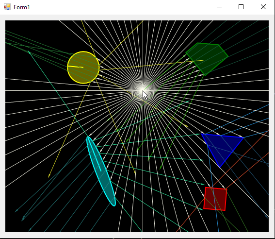

# WindowsRayBounceForm
Planar Ray bounce simulation written in C#

Create a beam of light rays which hit geometric objects. Each hit causes a reflection and a refraction, but these do not interaction with objects (yet).

## Instructions

Left-click on an object to drag it to a new position. Right-click on an object to adjust phase of rotation. 

Move pointer to adjust source of light beams. Right click on empty space to rotate light beams around.
# Screenshot

